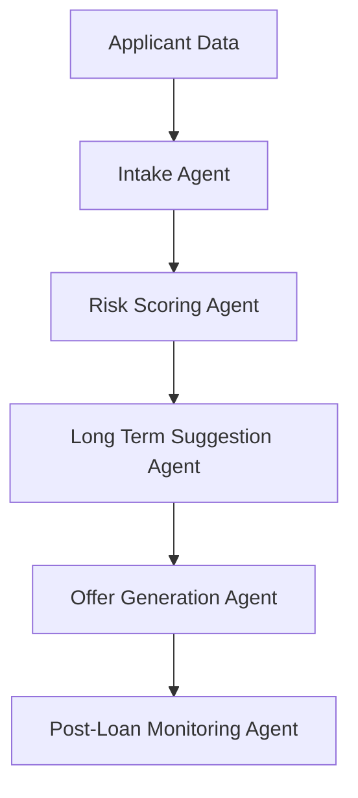

# Agentic AI in Lending – Reference Implementation

This repository presents a **simple, educational reference implementation** of how *agentic AI* can orchestrate multiple steps in a **lending workflow** for financial services and FinTech.

The goal is to show how specialized AI agents — each with a clear task — can collaborate to process loan applications, assess risk, recommend loan terms, generate offers, and monitor ongoing risk signals.

> This sample accompanies our article:  [Agentic AI in Lending](https://www.azilen.com/blog/agentic-ai-in-lending/)

---

## Why Agentic AI in Lending Matters

Traditional lending systems are often:

- Siloed: risk assessment separate from offer creation
- Hard to scale across product types
- Limited in personalized recommendation logic
- Difficult to explain to regulators

Agentic AI introduces an **orchestrated approach** where domain-specific agents work together but remain auditable and transparent.

---

## Lending Agent Workflow (Simplified)


Each agent performs a specific part of the lending lifecycle.

## How to Start with Agentic AI for Lending: A Quick Implementation Guide

### 1. Clone the repository

```bash
git clone https://github.com/KKAzilen/agentic-ai-lending-workflow.git
cd agentic-ai-lending-workflow/python
```
### 2. Create virtual environment (optional)

```bash
python3 -m venv venv
source venv/bin/activate
```
### 3. Install dependencies

```bash
pip install -r requirements.txt
```
### 4. Run the workflow

```bash
python agent.py
```

---

## Sample Loan Applicants

The sample dataset uses mock loan applicant profiles defined in ```sample_applicants.json```.
No real customer data is included.

---

## Extending This Reference

In real financial systems, this pattern can be extended with:

- Credit bureau / KYC agent integration
- Fraud scoring models
- Collateral evaluation agents
- Human-in-loop review workflows
- Audit logging for compliance

---

## Related Resources

If you’re exploring how agentic AI in lending workflows, these resources provide deeper context and real-world perspectives:

### Deep Dive: Agentic AI in Lending
A comprehensive, non-technical explanation of how agentic AI simplifies lending operations — from borrower onboarding and credit assessment to loan servicing and risk monitoring.

👉 Read the full article: [Agentic AI in Lending](https://www.azilen.com/blog/agentic-ai-in-lending/)

### Enterprise AI Agent Development by Azilen
Azilen helps financial institutions design and implement **agentic AI systems** that orchestrate complex workflows while remaining explainable, scalable, and compliant.

Our services cover:
- Agentic AI architecture design
- AI-driven lending and underwriting solutions
- Human-in-the-loop AI systems
- Secure and scalable enterprise AI deployments

👉 Explore our [AI Agent Development Services](https://www.azilen.com/ai-agents-development-services/)

---

## Disclaimer

This repository is intended **solely for educational and reference purposes** to illustrate architectural patterns and design concepts related to agentic AI in lending workflows.

It does **not** represent a production-ready lending system and should **not** be used for real-world credit decisioning, regulatory reporting, or customer-facing financial operations. Any use in live environments would require additional controls related to security, data privacy, model validation, governance, and regulatory compliance.

---

## About Azilen Technologies

This repository is part of Azilen Technologies’ ongoing effort to explore and demonstrate **practical, enterprise-oriented AI patterns** for the financial services ecosystem.

Being an [enterprise AI development company](https://www.azilen.com/), Azilen works with banks, FinTechs, and lending platforms to design and build scalable digital systems, including **agentic AI solutions** that support complex decision-making workflows such as lending, underwriting, risk management, and customer engagement.

---
